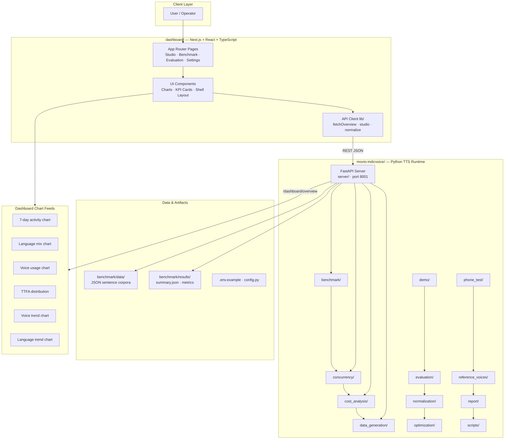
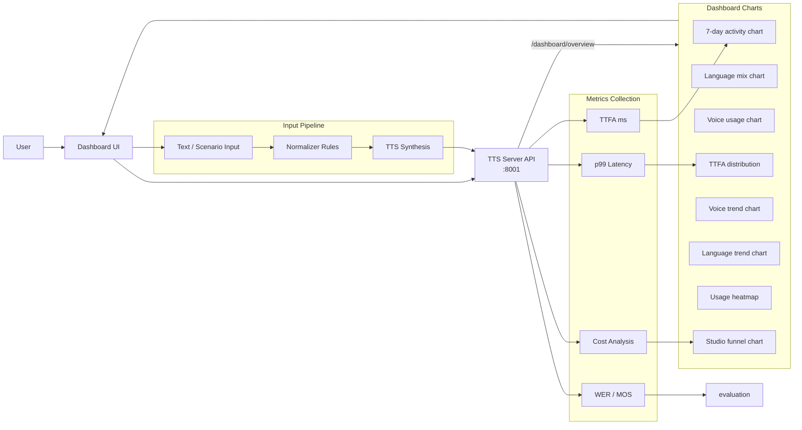
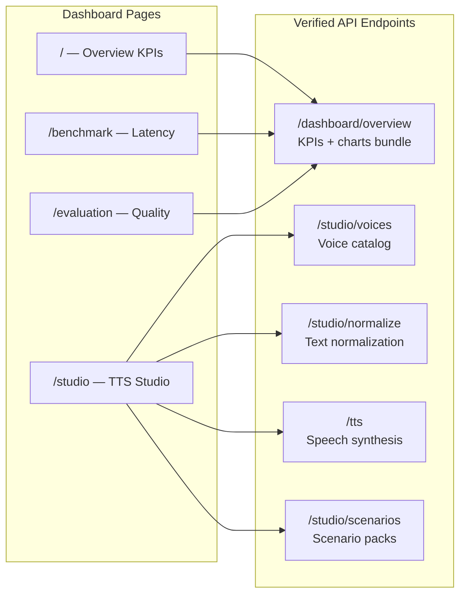
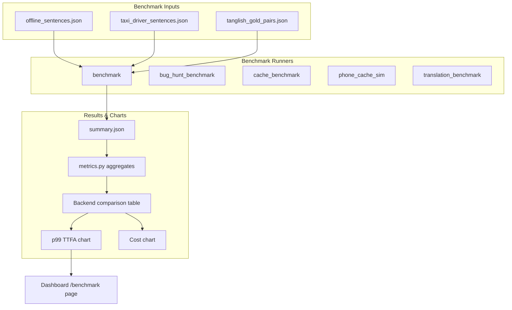
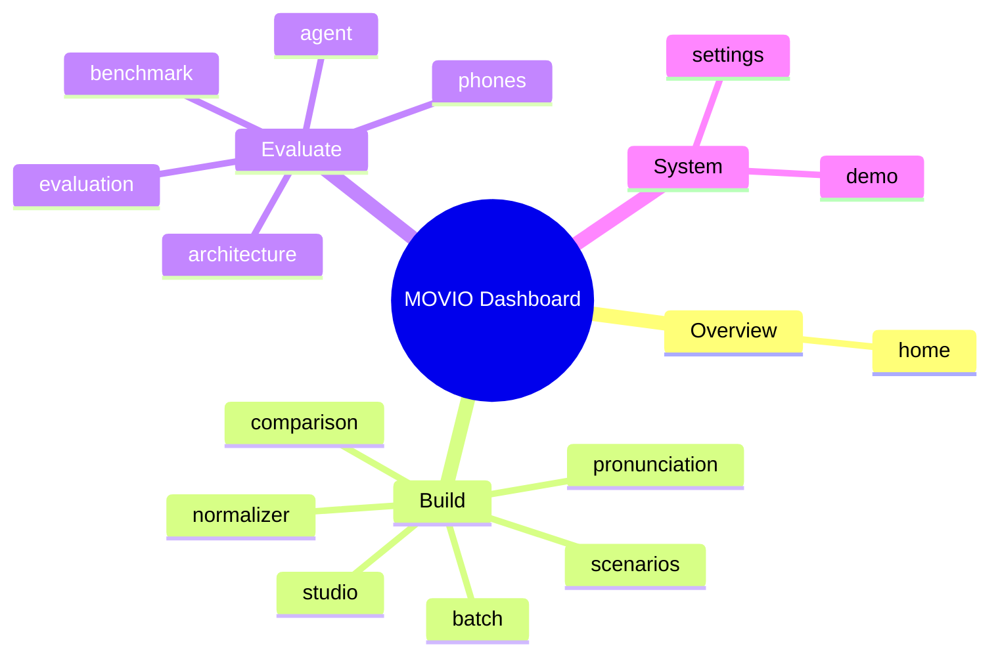

# MOVIO System Documentation

## 🚀 Overview

MOVIO is a comprehensive, three-tiered AI platform designed for advanced Text-to-Speech (TTS) synthesis, voice cloning, and rigorous performance benchmarking. The system provides end-to-end capabilities, from raw data ingestion and model training to real-time API deployment and detailed performance metric calculation.

### Key Features
*   **Advanced TTS Synthesis:** High-fidelity voice generation with customizable parameters.
*   **Voice Cloning:** Ability to synthesize speech using provided voice samples.
*   **Performance Benchmarking:** Automated evaluation of model quality using industry-standard metrics (e.g., WER, TTFA).
*   **Scalable Architecture:** Built on a microservices approach (Frontend/Backend/Core AI) for robust deployment.

## 🏗️ System Architecture

The MOVIO platform operates on a three-tier architecture, ensuring separation of concerns and scalability.

### 1. Client/Frontend (React/NPM)
*   **Role:** Provides the user interface for interacting with the system. It handles user input, displays results, and manages the overall workflow state.
*   **Technology:** React.js.
*   **Interaction:** Communicates exclusively with the Backend API.

### 2. Backend (Python/FastAPI)
*   **Role:** Acts as the primary API gateway and orchestration layer. It receives requests from the Frontend, validates inputs, manages session state, and calls the appropriate services within the Core AI layer.
*   **Technology:** Python, FastAPI.
*   **Interaction:** Coordinates data flow between the Frontend and the Core AI Services.

### 3. Core AI Services (PyTorch/CUDA)
*   **Role:** Contains the heavy computational lifting. This layer houses the specialized models for TTS synthesis, voice feature extraction, and the benchmarking logic.
*   **Technology:** PyTorch, CUDA (GPU acceleration is mandatory for optimal performance).
*   **Components:**
    *   **TTS Engine:** Handles the actual audio generation.
    *   **Feature Extractor:** Processes raw audio/text into usable model inputs.
    *   **Benchmarking Module:** Executes evaluation scripts and calculates metrics.

## ⚙️ Core Functionality & Pipelines

### 🎙️ Text-to-Speech (TTS) Synthesis Pipeline

1.  **Input:** User provides text and optional voice profile ID (or sample audio for cloning).
2.  **Preprocessing:** The Backend sends the request to the Core AI. The Feature Extractor normalizes the text and extracts necessary voice embeddings.
3.  **Synthesis:** The TTS Engine generates the raw audio waveform.
4.  **Output:** The synthesized audio is streamed back through the Backend to the Frontend for playback and download.

### 📊 Benchmarking and Evaluation Pipeline

This pipeline is used to measure the quality and efficiency of the synthesized audio against ground truth data.

1.  **Data Ingestion:** Evaluation data (text transcripts and reference audio) are uploaded to the system.
2.  **Execution:** The Benchmarking Module runs comparison algorithms against the generated audio.
3.  **Metrics Calculation:** Key performance indicators (KPIs) are calculated.
4.  **Visualization:** Results are displayed on the Frontend, providing a clear assessment of model performance.

## 💻 Technical Setup and Installation

**⚠️ Prerequisites:**
*   Python 3.8+ (Required for Backend and Core AI).
*   Node.js and NPM (Required for Frontend).
*   **CUDA Toolkit:** Installation of the correct CUDA version is mandatory for the Core AI services to run efficiently.

### 1. Backend Setup (Python)

```bash
# Clone the repository
git clone <repository-url>
cd movio-backend

# Install dependencies
pip install -r requirements.txt
```

### 2. Core AI Setup (PyTorch/CUDA)

```bash
# Navigate to the core AI directory
cd movio-core-ai

# Install PyTorch with CUDA support (Example command)
pip install torch torchvision torchaudio --index-url https://download.pytorch.org/whl/cu118

# Run the setup script
python setup.py install
```

### 3. Frontend Setup (React/NPM)

```bash
# Navigate to the frontend directory
cd movio-frontend

# Install dependencies
npm install
```

## 🚀 Running the System

**IMPORTANT:** The system must be run in a specific order, utilizing separate terminals for each service.

1.  **Start Core AI Services:** (Terminal 1)
    ```bash
    python movio-core-ai/run_server.py
    ```
2.  **Start Backend API:** (Terminal 2)
    ```bash
    uvicorn movio-backend.main:app --reload
    ```
3.  **Start Frontend Client:** (Terminal 3)
    ```bash
    npm run dev
    ```

## 🌐 API Endpoints Summary

The Backend exposes several key endpoints for managing the system lifecycle:

| Endpoint | Method | Description | Usage | 
| :--- | :--- | :--- | :--- |
| `/api/v1/tts/synthesize` | POST | Generates audio from text and voice profile. | Requires `text` and `voice_id` in body. |
| `/api/v1/benchmark/upload` | POST | Uploads evaluation data (text/audio pairs). | Used to initiate benchmarking runs. |
| `/api/v1/benchmark/results` | GET | Retrieves calculated performance metrics. | Requires `run_id` parameter. |
| `/api/v1/status` | GET | Checks the operational status of the core services. | Useful for health checks. |

## 📈 Performance Metrics

The system tracks several critical metrics to quantify performance and cost:

*   **Word Error Rate (WER):** Measures the difference between synthesized and reference text.
*   **Time To First Audio (TTFA):** Measures the latency from request submission to first audio byte received.
*   **P99 Latency:** The 99th percentile latency, indicating the experience of the slowest 1% of users.
*   **Operational Cost:** Tracks the estimated computational cost per 1000 characters synthesized.

## Setup Guide

### Backend Setup

_From `movio-indicvoice/README.md`:_


```bash
cd movio-indicvoice
python -m venv .venv

# Windows
.venv\Scripts\activate
# Linux/macOS
# source .venv/bin/activate

pip install -r requirements.txt
# On some Linux/PEP-668 systems:
#   pip install --break-system-packages -r requirements.txt

# CRITICAL for <500ms-class TTFA: install CUDA PyTorch (Windows pip defaults to CPU).
# Your machine has an NVIDIA GPU but `pip install torch` often installs `+cpu`.
# RTX 40-series example (CUDA 12.6 wheels):
pip uninstall -y torch
pip install torch --index-url https://download.pytorch.org/whl/cu126
# Confirm: python -c "import torch; print(torch.cuda.is_available(), torch.__version__)"
# Expect: True 2.x.x+cu126

# Optional local TTS (IndicF5) — gated HF model
pip install git+https://github.com/ai4bharat/IndicF5.git

# Ollama LLM (local, no API key)
# Install Ollama, then:
ollama pull gemma4:31b
# Drop-in alternative (same env var) — often more reliable under RAM pressure:
#   ollama pull gemma4:26b
#   set OLLAMA_MODEL=gemma4:26b
# For faster local generation on a laptop, `gemma4:latest` also works via OLLAMA_MODEL.

# Hugging Face gated model (IndicF5) — optional quality path
# Without access the F5 backend uses silent mock WAV; edge_fast still works online.
# 1. Create a HF account and request access:
#      https://huggingface.co/ai4bharat/IndicF5
# 2. Then in the venv:
#      pip install huggingface_hub
#      huggingface-cli login

### Frontend Setup (Dashboard)

```bash
cd dashboard
npm install
npm run dev     # development
npm run build && npm start   # production
```

Open `http://localhost:3000` (or the port shown in the terminal).

### Configuration

Copy environment templates before running:

- `movio-indicvoice/.env.example` → copy to `.env` in the same directory

Dashboard connects to the TTS server via `NEXT_PUBLIC_TTS_SERVER` (default `http://127.0.0.1:8001`).

### Running the Application

1. **Start the backend** (TTS server on port `8001`)
2. **Start the dashboard** (`npm run dev` in `dashboard/`)
3. Open the dashboard and verify engine status shows **online**

```bash
# Terminal 1 — Backend
cd movio-indicvoice && python -m server.main

# Terminal 2 — Frontend
cd dashboard && npm run dev
```

## System Architecture

High-level system design, data flows, API map, and workflow pipelines derived from the repository structure.

### System Architecture



### Data Flow & Charts Pipeline



### Component & API Map



### Benchmark Workflow Pipeline



### Dashboard Page Map



## Application Pages

Screenshots captured from the running application. Each page is listed with its function.

#### Home

Application page at `/`


#### Studio

Application page at `/studio`


#### Text Normalizer

Context-aware taxi-domain normalization — booking IDs, OTPs, phones, times, currency and Tanglish.


#### Batch Synthesis

Bulk generation for scripts and contact-center scenario packs. Each item uses the studio /tts path.


#### Comparison Lab

A/B voice comparison for the same utterance — measure TTFA and listen side by side.


#### Pronunciation

Custom overrides for place names, brands and domain terms — layered on the base lexicon.


#### Scenarios

Taxi contact-center use cases from the Movio acceptance suite — open any card in TTS Studio.


#### Two-Phone Test

Scan QR codes with two phones on the same Wi-Fi — STT → translate → TTS through this laptop.


#### Live Voice Agent

Multi-turn taxi contact-center flows — click an agent bubble to synthesize and play speech.


#### Benchmark

Latency & cost snapshots from on-disk benchmark runs plus live p99.


#### Evaluation

Quality metrics from acceptance tests, WER/CER, and MOS scoring artifacts.


#### Architecture

System design for the self-hosted Movio Indic voice stack.


#### Demo

Application page at `/demo`


#### Settings

Runtime defaults from the TTS server health endpoint.


