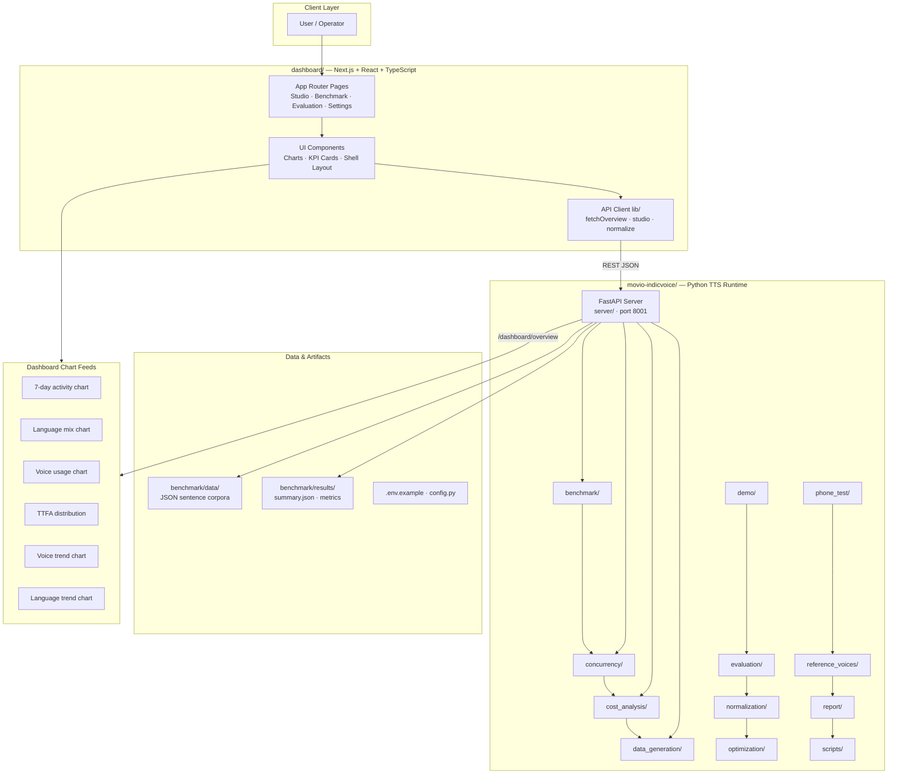
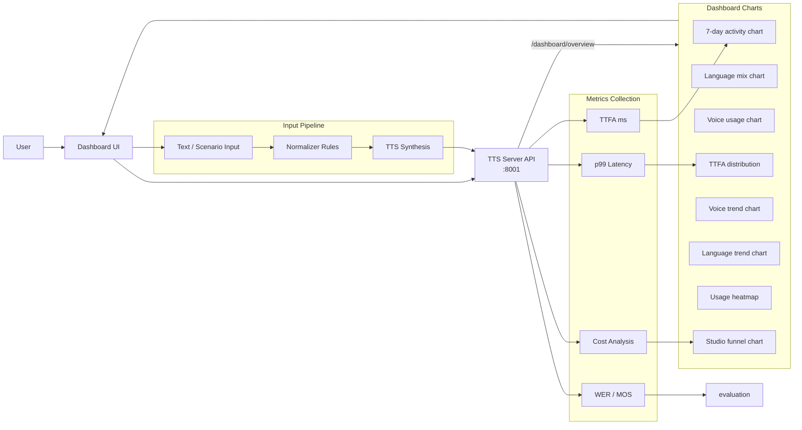
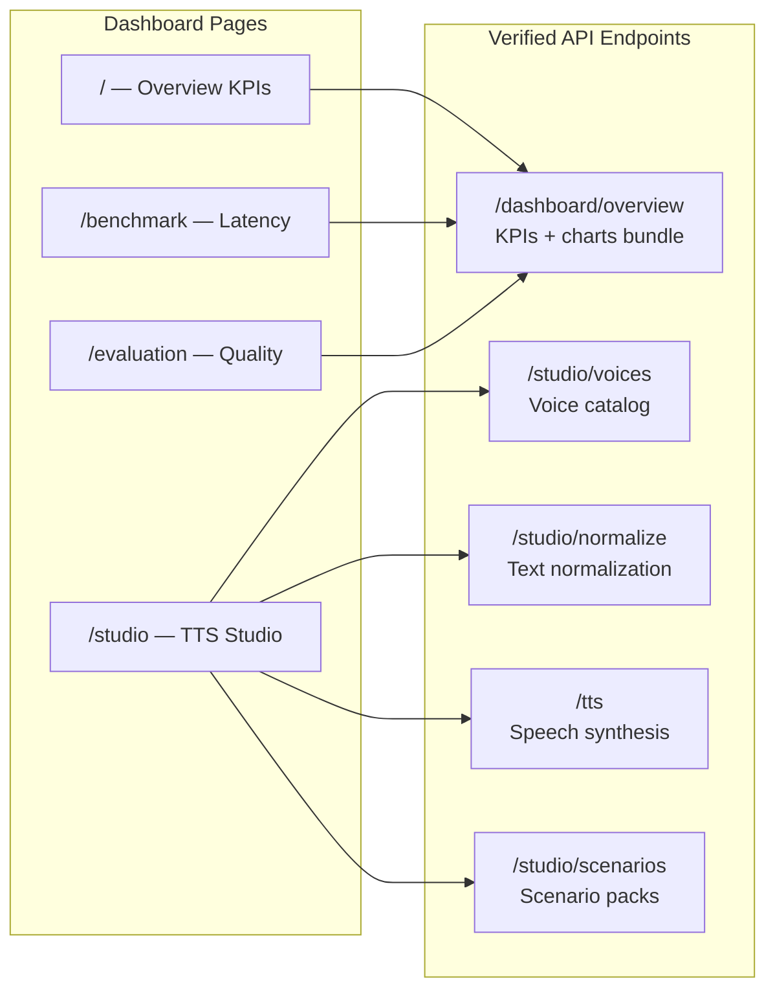
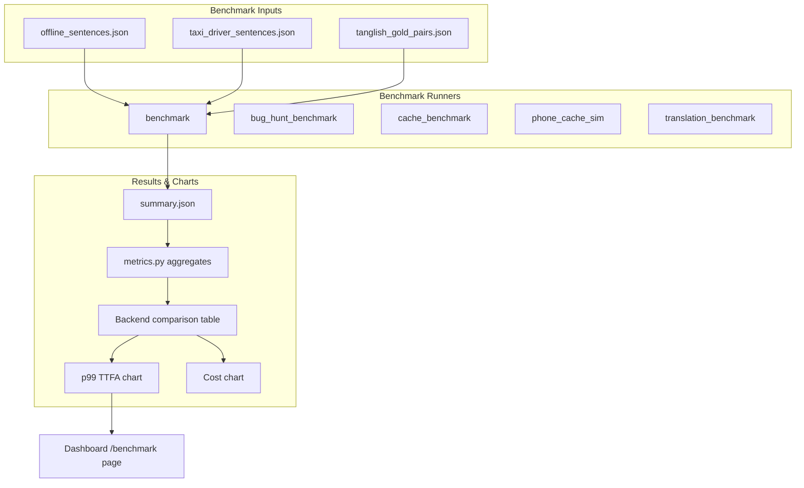
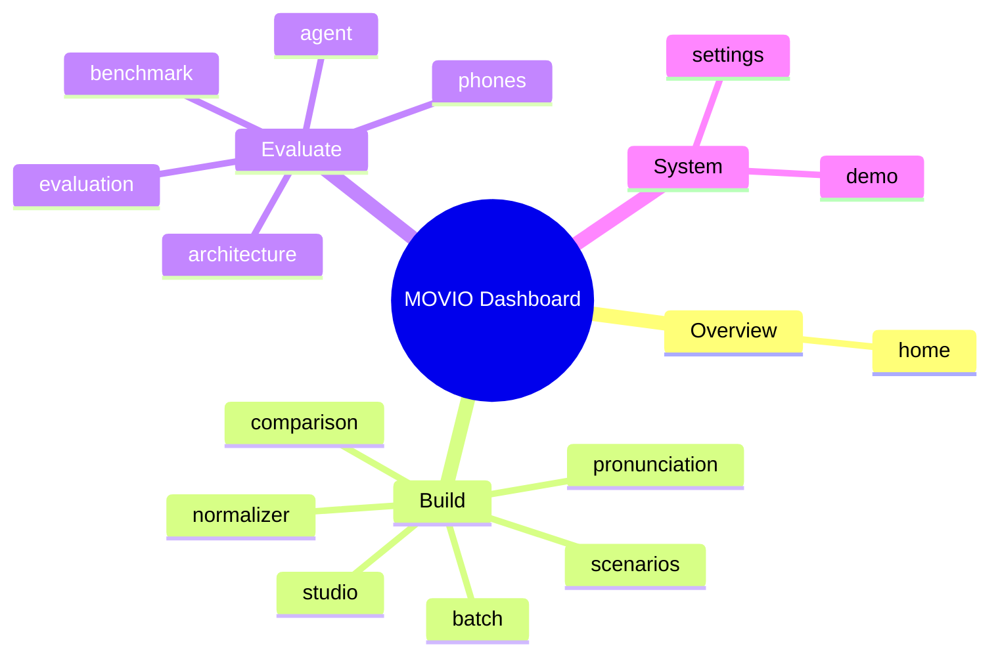

# 🎙️ Movio TTS Synthesis Platform

This repository provides a full-stack, high-performance platform for Text-to-Speech (TTS) synthesis and comprehensive audio quality benchmarking. The system is designed for low-latency, high-fidelity voice generation, supporting advanced features like speaker embedding and real-time performance monitoring.

## 🚀 Architecture Overview

The platform is structured into three interconnected services, ensuring scalability and separation of concerns:

1.  **Frontend (Client UI):** Built with React/Next.js. Handles user interaction, state management, and displaying synthesis results and benchmark metrics.
2.  **Backend (API Gateway):** Built with FastAPI/Python. Acts as the primary orchestration layer, validating incoming requests, managing session state, and routing requests to the Core AI service.
3.  **Core AI Engine (Inference):** Built with PyTorch and optimized for CUDA. This is the computational heart of the system, responsible for feature extraction, TTS synthesis, and running complex benchmarking models.

## ⚙️ Core Workflows

### 1. Text-to-Speech Synthesis

1.  The user inputs text and parameters via the **Frontend**.
2.  The **Frontend** sends the request to the **Backend** API Gateway.
3.  The **Backend** validates the request and passes it to the **Core AI Engine**.
4.  The **Core AI Engine** performs the TTS synthesis (e.g., using the IndicVoice model) and returns the raw audio data (or a stream).
5.  The **Backend** streams the audio data back to the **Frontend** for playback.

### 2. Audio Benchmarking

This workflow allows users to upload audio samples for quality assessment.

1.  The user uploads audio files via the **Frontend**.
2.  The **Backend** receives the files and passes them to the **Core AI Engine**.
3.  The **Core AI Engine** runs various quality metrics (e.g., WER, MOS prediction) and calculates performance statistics.
4.  The **Backend** returns the calculated metrics and reports to the **Frontend**.

## 🛠️ Setup and Installation Guide

**Prerequisites:**
*   Python 3.8+ (Recommended)
*   Node.js and npm
*   NVIDIA CUDA Toolkit (Crucial for the Core AI Engine)

### Step 1: Environment Setup

It is highly recommended to use a virtual environment for dependency management.

```bash
# Clone the repository (assuming the structure is local)
git clone <repository-url>
cd <repository-name>

# Create and activate virtual environment
python -m venv venv
source venv/bin/activate  # On Linux/macOS
# venv\Scripts\activate  # On Windows
```

### Step 2: Install Dependencies

Install dependencies for each component:

**A. Core AI Engine (PyTorch/CUDA)**

*Note: Ensure your CUDA version matches the required PyTorch installation.*

```bash
# Install core dependencies
pip install -r core_ai/requirements.txt
```

**B. Backend (FastAPI)**

```bash
pip install -r backend/requirements.txt
```

**C. Frontend (React/Next.js)**

```bash
# Install frontend dependencies
cd frontend
npm install
cd ..
```

## ▶️ Running the Application

Due to the multi-service architecture, the application must be run in three separate terminals.

### Terminal 1: Core AI Engine (Inference)

This service must be running first as it provides the core functionality.

```bash
# Ensure virtual environment is active
python core_ai/main.py
```

### Terminal 2: Backend (API Gateway)

This service connects the frontend to the core AI engine.

```bash
# Ensure virtual environment is active
uvicorn backend.main:app --reload
```

### Terminal 3: Frontend (Client UI)

This starts the user interface.

```bash
# Ensure you are in the 'frontend' directory
npm run dev
```

## 🌐 API Endpoints and Functionality

### Backend API Endpoints (FastAPI)

| Endpoint | Method | Description | Usage | 
| :--- | :--- | :--- | :--- |
| `/api/tts/synthesize` | POST | Performs TTS synthesis based on text and speaker ID. | Requires `text` and `speaker_id` in body. | 
| `/api/benchmark/upload` | POST | Accepts audio files for quality benchmarking. | Accepts file upload and metadata. | 

### Core AI Engine Functionality

*   **TTS Synthesis:** Supports high-quality, low-latency voice generation.
*   **Benchmarking:** Calculates metrics such as Word Error Rate (WER) and Mean Opinion Score (MOS) prediction.
*   **Performance:** Optimized for CUDA acceleration, achieving low latency (e.g., P99 latency metrics are tracked).

## 📊 Key Performance Metrics

The system tracks and reports several critical metrics for quality assurance:

*   **Word Error Rate (WER):** Measures the accuracy of transcribed text against the source text.
*   **Mean Opinion Score (MOS):** A predicted score indicating the perceived quality of the synthesized speech (1-5 scale).
*   **Latency:** Measures the time taken for synthesis, with specific tracking for P99 performance.

## Setup Guide

### Backend Setup

_From `movio-indicvoice/README.md`:_


```bash
cd movio-indicvoice
python -m venv .venv

# Windows
.venv\Scripts\activate
# Linux/macOS
# source .venv/bin/activate

pip install -r requirements.txt
# On some Linux/PEP-668 systems:
#   pip install --break-system-packages -r requirements.txt

# CRITICAL for <500ms-class TTFA: install CUDA PyTorch (Windows pip defaults to CPU).
# Your machine has an NVIDIA GPU but `pip install torch` often installs `+cpu`.
# RTX 40-series example (CUDA 12.6 wheels):
pip uninstall -y torch
pip install torch --index-url https://download.pytorch.org/whl/cu126
# Confirm: python -c "import torch; print(torch.cuda.is_available(), torch.__version__)"
# Expect: True 2.x.x+cu126

# Optional local TTS (IndicF5) — gated HF model
pip install git+https://github.com/ai4bharat/IndicF5.git

# Ollama LLM (local, no API key)
# Install Ollama, then:
ollama pull gemma4:31b
# Drop-in alternative (same env var) — often more reliable under RAM pressure:
#   ollama pull gemma4:26b
#   set OLLAMA_MODEL=gemma4:26b
# For faster local generation on a laptop, `gemma4:latest` also works via OLLAMA_MODEL.

# Hugging Face gated model (IndicF5) — optional quality path
# Without access the F5 backend uses silent mock WAV; edge_fast still works online.
# 1. Create a HF account and request access:
#      https://huggingface.co/ai4bharat/IndicF5
# 2. Then in the venv:
#      pip install huggingface_hub
#      huggingface-cli login

### Frontend Setup (Dashboard)

```bash
cd dashboard
npm install
npm run dev     # development
npm run build && npm start   # production
```

Open `http://localhost:3000` (or the port shown in the terminal).

### Configuration

Copy environment templates before running:

- `movio-indicvoice/.env.example` → copy to `.env` in the same directory

Dashboard connects to the TTS server via `NEXT_PUBLIC_TTS_SERVER` (default `http://127.0.0.1:8001`).

### Running the Application

1. **Start the backend** (TTS server on port `8001`)
2. **Start the dashboard** (`npm run dev` in `dashboard/`)
3. Open the dashboard and verify engine status shows **online**

```bash
# Terminal 1 — Backend
cd movio-indicvoice && python -m server.main

# Terminal 2 — Frontend
cd dashboard && npm run dev
```

## System Architecture

High-level system design, data flows, API map, and workflow pipelines derived from the repository structure.

### System Architecture



### Data Flow & Charts Pipeline



### Component & API Map



### Benchmark Workflow Pipeline



### Dashboard Page Map



## Application Pages

Screenshots captured from the running application. Each page is listed with its function.

#### Home

Application page at `/`


#### Studio

Application page at `/studio`


#### Text Normalizer

Context-aware taxi-domain normalization — booking IDs, OTPs, phones, times, currency and Tanglish.


#### Batch Synthesis

Bulk generation for scripts and contact-center scenario packs. Each item uses the studio /tts path.


#### Comparison Lab

A/B voice comparison for the same utterance — measure TTFA and listen side by side.


#### Pronunciation

Custom overrides for place names, brands and domain terms — layered on the base lexicon.


#### Scenarios

Taxi contact-center use cases from the Movio acceptance suite — open any card in TTS Studio.


#### Two-Phone Test

Scan QR codes with two phones on the same Wi-Fi — STT → translate → TTS through this laptop.


#### Live Voice Agent

Multi-turn taxi contact-center flows — click an agent bubble to synthesize and play speech.


#### Benchmark

Latency & cost snapshots from on-disk benchmark runs plus live p99.


#### Evaluation

Quality metrics from acceptance tests, WER/CER, and MOS scoring artifacts.


#### Architecture

System design for the self-hosted Movio Indic voice stack.


#### Demo

Application page at `/demo`


#### Settings

Runtime defaults from the TTS server health endpoint.


