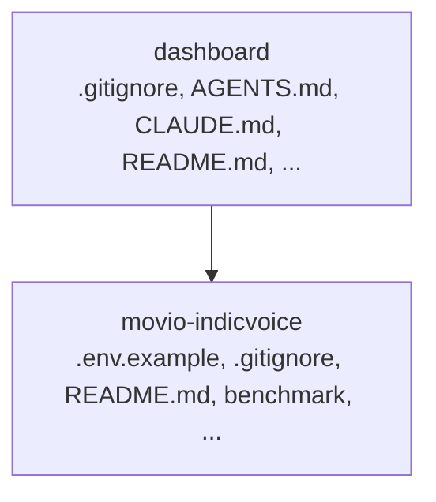
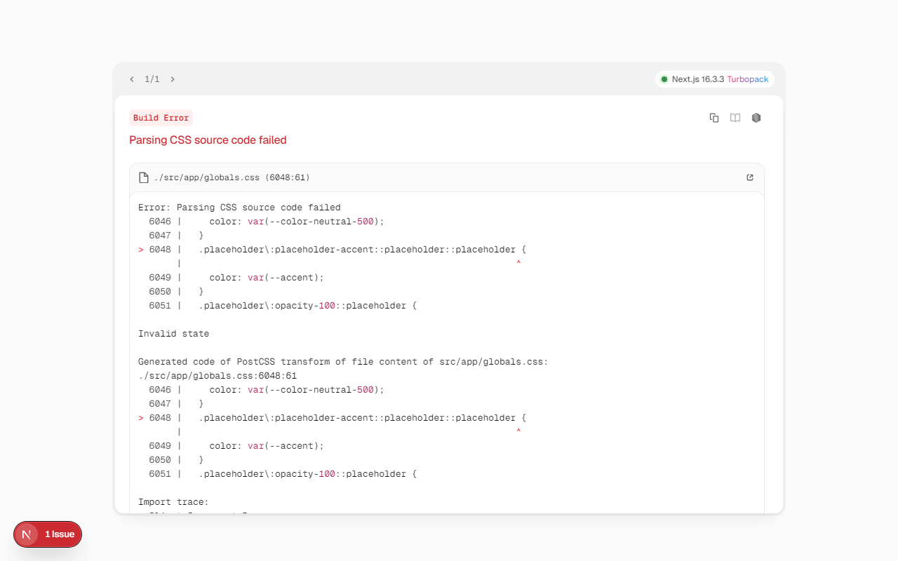

## Movio: Comprehensive Performance Analysis Platform

A multi-component platform featuring a dashboard for visualization and backend modules for benchmarking, concurrency testing, and cost analysis.

## Overview

MOVIO is a comprehensive project designed for analyzing and managing performance metrics. It consists of two main parts: a frontend dashboard for visualizing results and a backend module (`movio-indicvoice/`) containing specialized tools for rigorous performance testing, data generation, and cost analysis.

## Features

MOVIO provides a suite of tools to analyze and manage performance metrics, including:

*   **Dashboard Interface:** A dedicated frontend for visualizing results and interacting with the system (`dashboard/`).
*   **Benchmarking Capabilities:** Tools for rigorous performance testing across various scenarios (`movio-indicvoice/benchmark/`).
*   **Concurrency and Load Testing:** Modules for simulating high-load environments and monitoring resources (`movio-indicvoice/concurrency/`).
*   **Data Generation Utilities:** Tools to create synthetic data for testing and analysis (`movio-indicvoice/data_generation/`).
*   **Cost Analysis:** Calculation modules to estimate and analyze operational costs (`movio-indicvoice/cost_analysis/`).

## Tech Stack

MOVIO utilizes a modern, multi-language stack:

*   Python
*   TypeScript
*   JavaScript
*   HTML
*   CSS
*   Next.js
*   React

## Project Structure

The repository is logically separated into two main components:

*   **`dashboard/`**: Contains the frontend assets, configuration, and logic for the user interface. The frontend uses Next.js and React.
*   **`movio-indicvoice/`**: Houses the core backend logic, utilities, and specialized modules, including benchmarking, concurrency tools, and cost analysis scripts. This component is primarily written in Python.

## Architecture

### Architecture

### Workflow

## Configuration

Configuration for the project can be managed through the following files:

*   `dashboard/tsconfig.json`
*   `movio-indicvoice/.env.example`

## Live Preview

_Captured from running dev server at http://127.0.0.1:3456_

## Live Preview

_Captured from running dev server at http://localhost:3456_
