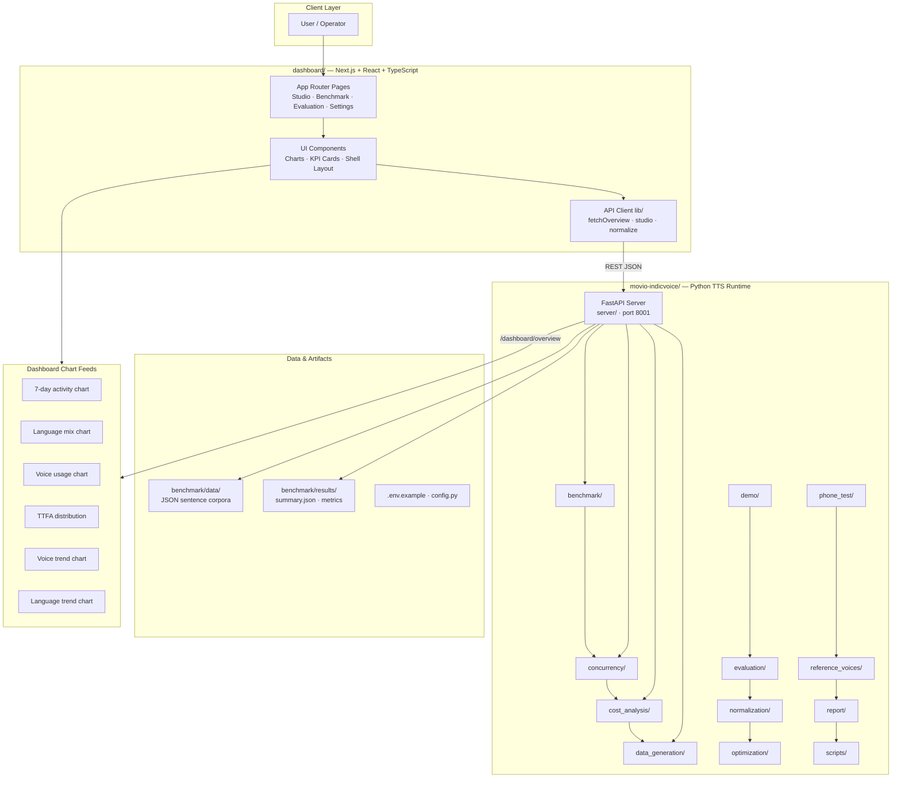
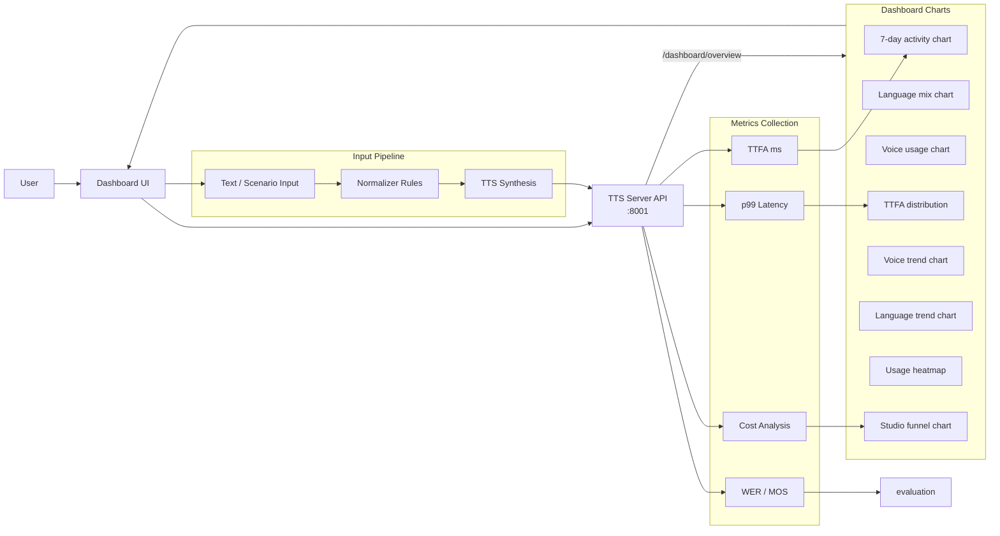
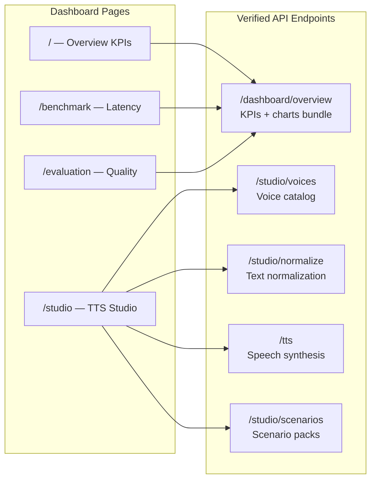
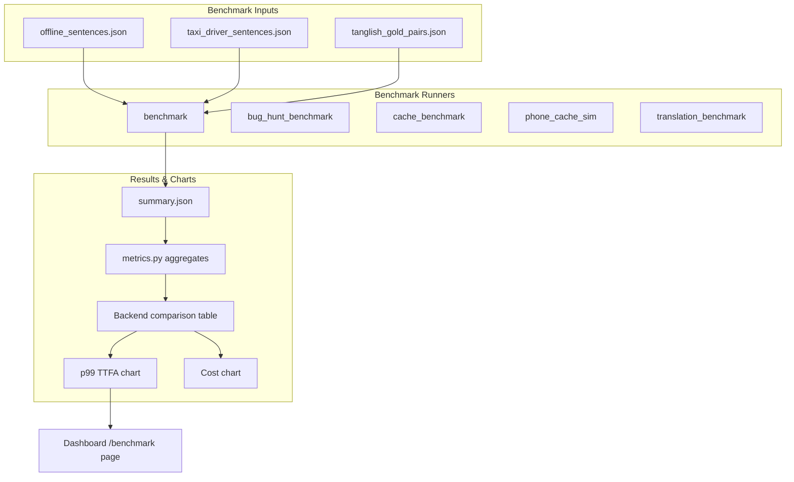
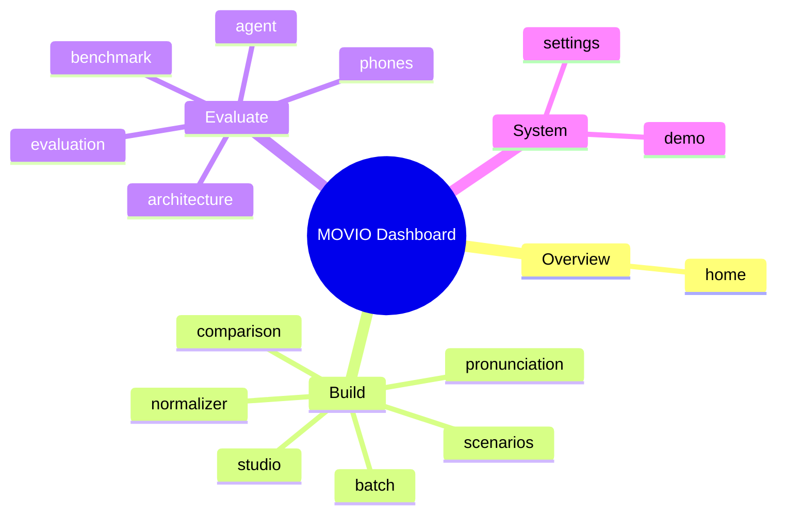

# 🎙️ MOVIO: Indic Voice Synthesis and Evaluation Platform

MOVIO is a comprehensive, multi-functional platform designed for the synthesis, evaluation, and benchmarking of Indic languages' voice models. It provides a robust, end-to-end solution covering text normalization, advanced Text-to-Speech (TTS) generation, and rigorous performance metric calculation.

## 🚀 Overview

MOVIO operates on a three-tier architecture, separating the user interface (Client), the business logic and API gateway (Backend), and the core computational models (Services). This separation ensures scalability, maintainability, and the ability to independently update complex components like TTS models or metric calculators.

### Key Features
*   **Indic Language Support:** Specialized handling for diverse Indian languages.
*   **End-to-End TTS:** Seamless pipeline from raw text input to high-quality audio output.
*   **Automated Benchmarking:** Calculates industry-standard metrics (e.g., Word Error Rate, True Tone Feature Accuracy) for model comparison.
*   **Scalable Architecture:** Built using modern frameworks (FastAPI, Next.js) for enterprise deployment.

## 🏗️ Architecture and Components

The system is structured into three primary layers:

### 1. Client (Frontend)
*   **Technology:** Next.js / React
*   **Role:** Handles the User Interface (UI). It is responsible for capturing user input (text, language selection), displaying results (audio player, metrics), and making asynchronous API calls to the Backend.

### 2. Backend (API Gateway)
*   **Technology:** FastAPI / Python
*   **Role:** Acts as the central orchestrator. It receives requests from the Client, validates input, manages state, and routes the request to the appropriate core service (TTS or Benchmarking). It handles authentication and rate limiting.

### 3. Core Services (Computational Logic)
*   **Technology:** Python Modules (PyTorch, Transformers, etc.)
*   **Role:** Contains the heavy lifting. These services are isolated and include:
    *   **Text Normalization:** Converts raw text (e.g., numbers, abbreviations) into a standardized format suitable for TTS.
    *   **TTS Engine:** The core model that converts normalized text embeddings into audio waveforms.
    *   **Metrics Engine:** Calculates quantitative performance scores (WER, TTFA, etc.) by comparing generated output against ground truth data.

## ⚙️ Core Functionality Pipelines

### 🎤 Text-to-Speech (TTS) Synthesis
This pipeline is triggered when a user submits text for synthesis.

1.  **Input:** Raw Text + Language ID $
ightarrow$ Backend API.
2.  **Normalization:** The text is passed through the Normalization Service to clean and standardize the input.
3.  **Synthesis:** The normalized text is fed into the TTS Engine, which generates the audio waveform.
4.  **Output:** The audio data is streamed back through the Backend to the Client for playback.

### 📊 Benchmarking and Evaluation
This pipeline is used to compare multiple models against a dataset.

1.  **Data Ingestion:** A dataset (text, ground truth audio) is uploaded/referenced.
2.  **Execution:** The Backend iterates through registered models, running the TTS pipeline for each one.
3.  **Metric Calculation:** The Metrics Engine compares the generated audio/text against the ground truth, calculating scores like Word Error Rate (WER) and True Tone Feature Accuracy (TTFA).
4.  **Storage & Display:** Results are persisted in the database and displayed on the Client dashboard.

## 🛠️ Setup and Installation Guide

**Prerequisites:**
*   Python 3.8+ environment.
*   NVIDIA GPU with CUDA installed (Highly recommended for model inference).
*   `pip` and `npm` installed.

### Step 1: Backend Setup (API Gateway & Services)

```bash
# 1. Create and activate virtual environment
python -m venv venv
source venv/bin/activate

# 2. Install dependencies
pip install -r requirements.txt

# 3. Log in to Hugging Face (if required for model access)
huggingface-cli login
```

### Step 2: Frontend Setup (Client)

```bash
# 1. Navigate to the client directory
cd client

# 2. Install Node dependencies
npm install
```

### Step 3: Running the Application

**NOTE:** The application requires two separate terminals to run concurrently.

**Terminal 1 (Backend):**
```bash
# Ensure you are in the root directory and venv is active
uvicorn main:app --reload --host 0.0.0.0 --port 8000
```

**Terminal 2 (Frontend):**
```bash
# Ensure you are in the client directory
npm run dev
```

## 🌐 API Endpoints Summary

| Endpoint | Method | Description | Purpose | Status | 
| :--- | :--- | :--- | :--- | :--- | 
| `/api/v1/tts/synthesize` | POST | Generates audio from text input. | TTS Synthesis | Available | 
| `/api/v1/benchmark/run` | POST | Initiates a model benchmarking run. | Evaluation | Available | 
| `/api/v1/status` | GET | Checks the operational status of the platform. | Health Check | Available | 

## 📚 Data Model

*   **`SynthesisRequest`:** Contains `text` (string), `language_code` (string), and `model_id` (string). Used for TTS.
*   **`BenchmarkJob`:** Contains `dataset_id` (string), `models` (list of strings), and `start_time` (datetime). Used for evaluation.
*   **`Result`:** Stores the output, including `audio_url`, `metrics` (JSON object), and `timestamp`.

## Setup Guide

### Backend Setup

_From `movio-indicvoice/README.md`:_


```bash
cd movio-indicvoice
python -m venv .venv

# Windows
.venv\Scripts\activate
# Linux/macOS
# source .venv/bin/activate

pip install -r requirements.txt
# On some Linux/PEP-668 systems:
#   pip install --break-system-packages -r requirements.txt

# CRITICAL for <500ms-class TTFA: install CUDA PyTorch (Windows pip defaults to CPU).
# Your machine has an NVIDIA GPU but `pip install torch` often installs `+cpu`.
# RTX 40-series example (CUDA 12.6 wheels):
pip uninstall -y torch
pip install torch --index-url https://download.pytorch.org/whl/cu126
# Confirm: python -c "import torch; print(torch.cuda.is_available(), torch.__version__)"
# Expect: True 2.x.x+cu126

# Optional local TTS (IndicF5) — gated HF model
pip install git+https://github.com/ai4bharat/IndicF5.git

# Ollama LLM (local, no API key)
# Install Ollama, then:
ollama pull gemma4:31b
# Drop-in alternative (same env var) — often more reliable under RAM pressure:
#   ollama pull gemma4:26b
#   set OLLAMA_MODEL=gemma4:26b
# For faster local generation on a laptop, `gemma4:latest` also works via OLLAMA_MODEL.

# Hugging Face gated model (IndicF5) — optional quality path
# Without access the F5 backend uses silent mock WAV; edge_fast still works online.
# 1. Create a HF account and request access:
#      https://huggingface.co/ai4bharat/IndicF5
# 2. Then in the venv:
#      pip install huggingface_hub
#      huggingface-cli login

### Frontend Setup (Dashboard)

```bash
cd dashboard
npm install
npm run dev     # development
npm run build && npm start   # production
```

Open `http://localhost:3000` (or the port shown in the terminal).

### Configuration

Copy environment templates before running:

- `movio-indicvoice/.env.example` → copy to `.env` in the same directory

Dashboard connects to the TTS server via `NEXT_PUBLIC_TTS_SERVER` (default `http://127.0.0.1:8001`).

### Running the Application

1. **Start the backend** (TTS server on port `8001`)
2. **Start the dashboard** (`npm run dev` in `dashboard/`)
3. Open the dashboard and verify engine status shows **online**

```bash
# Terminal 1 — Backend
cd movio-indicvoice && python -m server.main

# Terminal 2 — Frontend
cd dashboard && npm run dev
```

## System Architecture

High-level system design, data flows, API map, and workflow pipelines derived from the repository structure.

### System Architecture



### Data Flow & Charts Pipeline



### Component & API Map



### Benchmark Workflow Pipeline



### Dashboard Page Map



## Application Pages

Screenshots captured from the running application. Each page is listed with its function.

#### Home

Application page at `/`


#### Studio

Application page at `/studio`


#### Text Normalizer

Context-aware taxi-domain normalization — booking IDs, OTPs, phones, times, currency and Tanglish.


#### Batch Synthesis

Bulk generation for scripts and contact-center scenario packs. Each item uses the studio /tts path.


#### Comparison Lab

A/B voice comparison for the same utterance — measure TTFA and listen side by side.


#### Pronunciation

Custom overrides for place names, brands and domain terms — layered on the base lexicon.


#### Scenarios

Taxi contact-center use cases from the Movio acceptance suite — open any card in TTS Studio.


#### Two-Phone Test

Scan QR codes with two phones on the same Wi-Fi — STT → translate → TTS through this laptop.


#### Live Voice Agent

Multi-turn taxi contact-center flows — click an agent bubble to synthesize and play speech.


#### Benchmark

Latency & cost snapshots from on-disk benchmark runs plus live p99.


#### Evaluation

Quality metrics from acceptance tests, WER/CER, and MOS scoring artifacts.


#### Architecture

System design for the self-hosted Movio Indic voice stack.


#### Demo

Application page at `/demo`


#### Settings

Runtime defaults from the TTS server health endpoint.


