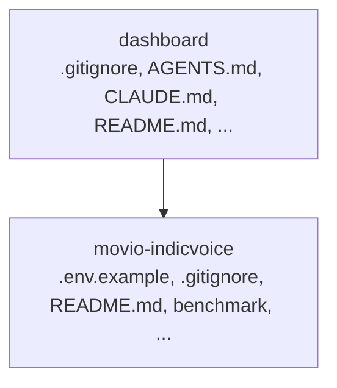

## Movio: Comprehensive Performance Analysis Platform

A multi-component platform featuring a dashboard for visualization and backend modules for benchmarking, concurrency testing, and cost analysis.

## Overview

MOVIO is a comprehensive project designed for analyzing and managing performance metrics. It consists of two main parts: a frontend dashboard for visualizing results and a backend module (`movio-indicvoice/`) containing specialized tools for rigorous performance testing, data generation, and cost analysis.

## Features

MOVIO provides a suite of tools to analyze and manage performance metrics, including:

*   **Dashboard Interface:** A dedicated frontend for visualizing results and interacting with the system (`dashboard/`).
*   **Benchmarking Capabilities:** Tools for rigorous performance testing across various scenarios (`movio-indicvoice/benchmark/`).
*   **Concurrency and Load Testing:** Modules for simulating high-load environments and monitoring resources (`movio-indicvoice/concurrency/`).
*   **Data Generation Utilities:** Tools to create synthetic data for testing and analysis (`movio-indicvoice/data_generation/`).
*   **Cost Analysis:** Calculation modules to estimate and analyze operational costs (`movio-indicvoice/cost_analysis/`).

## Tech Stack

MOVIO utilizes a modern, multi-language stack:

*   Python
*   TypeScript
*   JavaScript
*   HTML
*   CSS

## Project Structure

The repository is logically separated into two main components:

*   **`dashboard/`**: Contains the frontend assets, configuration, and logic for the user interface. The frontend uses Next.js and React.
*   **`movio-indicvoice/`**: Houses the core backend logic, utilities, and specialized modules, including benchmarking, concurrency tools, and cost analysis scripts. This component is primarily written in Python.

## Architecture

### System Diagram

### Workflow

## Configuration

Configuration for the project can be managed through the following files:

*   `dashboard/tsconfig.json`
*   `movio-indicvoice/.env.example`

## Application Pages

Screenshots captured from the running application. Each page is listed with its function.

#### Home

Application page at `/`

#### Studio

Application page at `/studio`

#### Text Normalizer

Context-aware taxi-domain normalization — booking IDs, OTPs, phones, times, currency and Tanglish.

#### Batch Synthesis

Bulk generation for scripts and contact-center scenario packs. Each item uses the studio /tts path.

#### Comparison Lab

A/B voice comparison for the same utterance — measure TTFA and listen side by side.

#### Pronunciation

Custom overrides for place names, brands and domain terms — layered on the base lexicon.

#### Scenarios

Taxi contact-center use cases from the Movio acceptance suite — open any card in TTS Studio.

#### Two-Phone Test

Scan QR codes with two phones on the same Wi-Fi — STT → translate → TTS through this laptop.

#### Live Voice Agent

Multi-turn taxi contact-center flows — click an agent bubble to synthesize and play speech.

#### Benchmark

Latency & cost snapshots from on-disk benchmark runs plus live p99.

#### Evaluation

Quality metrics from acceptance tests, WER/CER, and MOS scoring artifacts.

#### Architecture

System design for the self-hosted Movio Indic voice stack.

#### Demo

Application page at `/demo`

#### Settings

Runtime defaults from the TTS server health endpoint.

