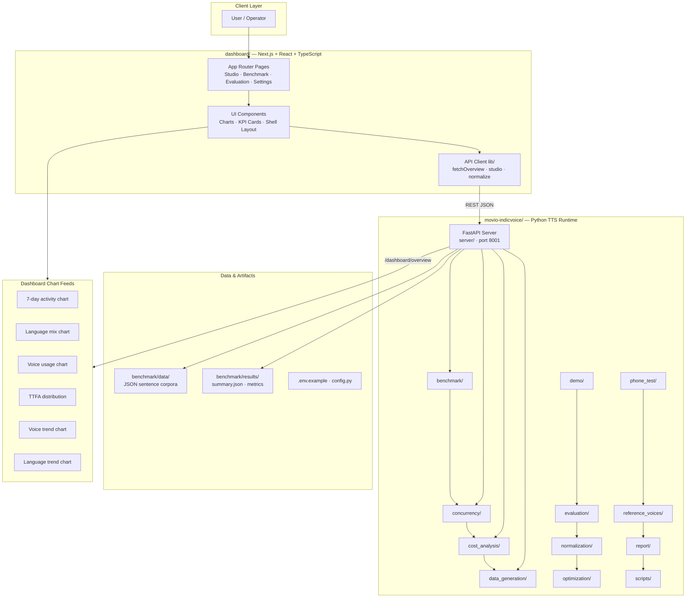
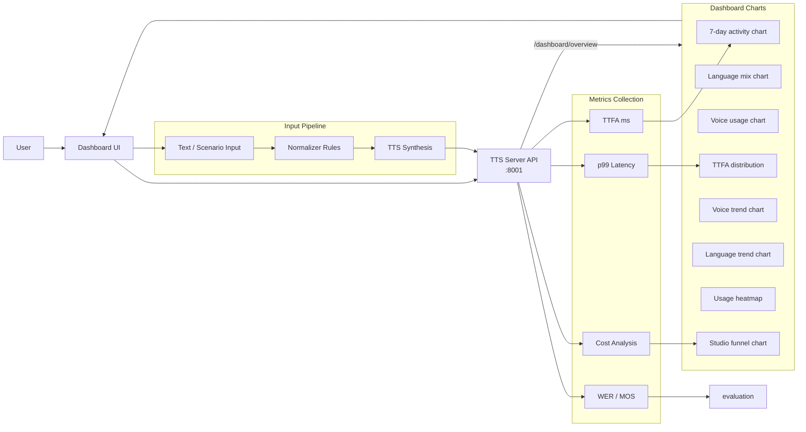
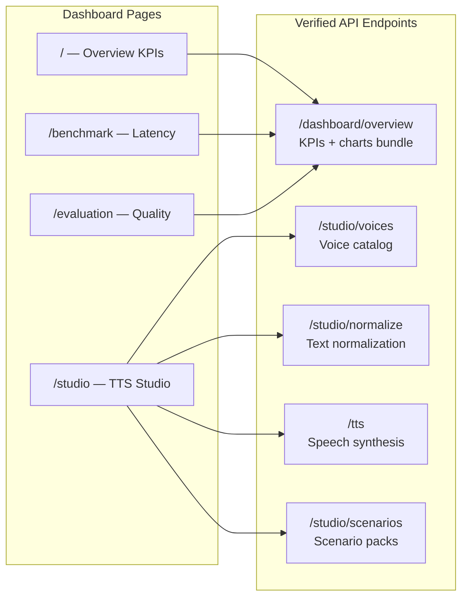
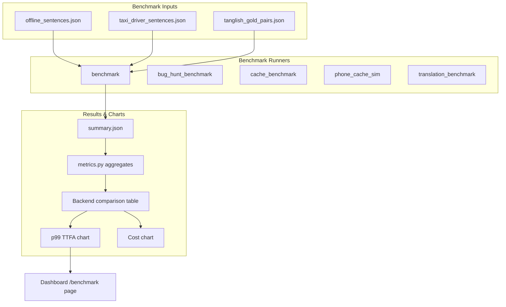
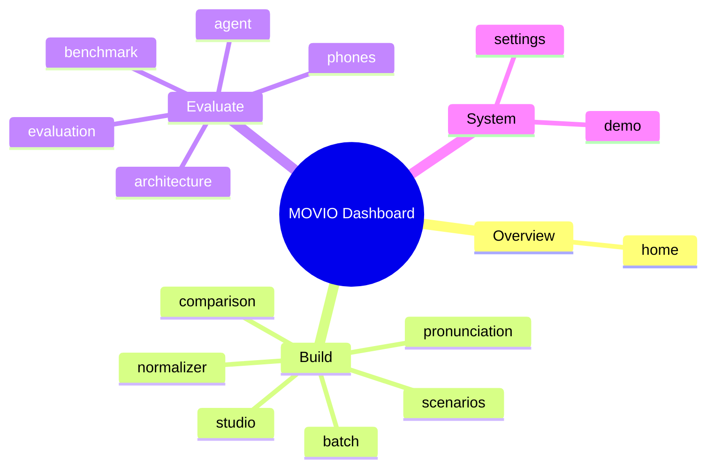

## Movio: Comprehensive Performance Analysis Platform

A multi-component platform featuring a dashboard for visualization and backend modules for benchmarking, concurrency testing, and cost analysis.

## Overview

MOVIO is a comprehensive project designed for analyzing and managing performance metrics. It consists of two main parts: a frontend dashboard for visualizing results and a backend module (`movio-indicvoice/`) containing specialized tools for rigorous performance testing, data generation, and cost analysis.

## Features

MOVIO provides a suite of tools to analyze and manage performance metrics, including:

*   **Dashboard Interface:** A dedicated frontend for visualizing results and interacting with the system (`dashboard/`).
*   **Benchmarking Capabilities:** Tools for rigorous performance testing across various scenarios (`movio-indicvoice/benchmark/`).
*   **Concurrency and Load Testing:** Modules for simulating high-load environments and monitoring resources (`movio-indicvoice/concurrency/`).
*   **Data Generation Utilities:** Tools to create synthetic data for testing and analysis (`movio-indicvoice/data_generation/`).
*   **Cost Analysis:** Calculation modules to estimate and analyze operational costs (`movio-indicvoice/cost_analysis/`).

## Tech Stack

MOVIO utilizes a modern, multi-language stack:

*   Python
*   TypeScript
*   JavaScript
*   HTML
*   CSS

## Project Structure

The repository is logically separated into two main components:

*   **`dashboard/`**: Contains the frontend assets, configuration, and logic for the user interface. The frontend uses Next.js and React.
*   **`movio-indicvoice/`**: Houses the core backend logic, utilities, and specialized modules, including benchmarking, concurrency tools, and cost analysis scripts. This component is primarily written in Python.

## Setup Guide

### Backend Setup

```bash
cd movio-indicvoice
python -m venv .venv
# Windows: .venv\Scripts\activate
# Linux/macOS: source .venv/bin/activate
pip install -r requirements.txt
copy .env.example .env   # Windows
# cp .env.example .env     # Linux/macOS
python -m server.main    # default port 8001
```

### Frontend Setup (Dashboard)

```bash
cd dashboard
npm install
npm run dev     # development
npm run build && npm start   # production
```

Open `http://localhost:3000` (or the port shown in the terminal).

### Configuration

Copy environment templates before running:

- `movio-indicvoice/.env.example` → copy to `.env` in the same directory

Dashboard connects to the TTS server via `NEXT_PUBLIC_TTS_SERVER` (default `http://127.0.0.1:8001`).

### Running the Application

1. **Start the backend** (TTS server on port `8001`)
2. **Start the dashboard** (`npm run dev` in `dashboard/`)
3. Open the dashboard and verify engine status shows **online**

```bash
# Terminal 1 — Backend
cd movio-indicvoice && python -m server.main

# Terminal 2 — Frontend
cd dashboard && npm run dev
```

## System Architecture

High-level system design, data flows, API map, and workflow pipelines derived from the repository structure.

### System Architecture



### Data Flow & Charts Pipeline



### Component & API Map



### Benchmark Workflow Pipeline



### Dashboard Page Map


